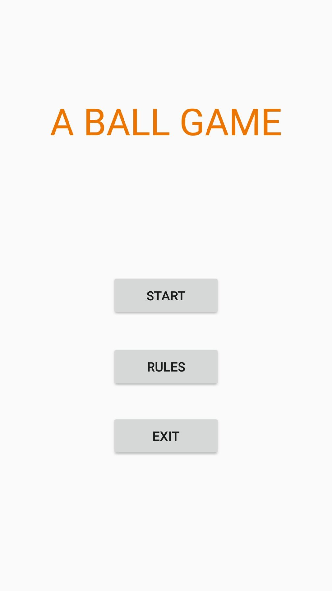
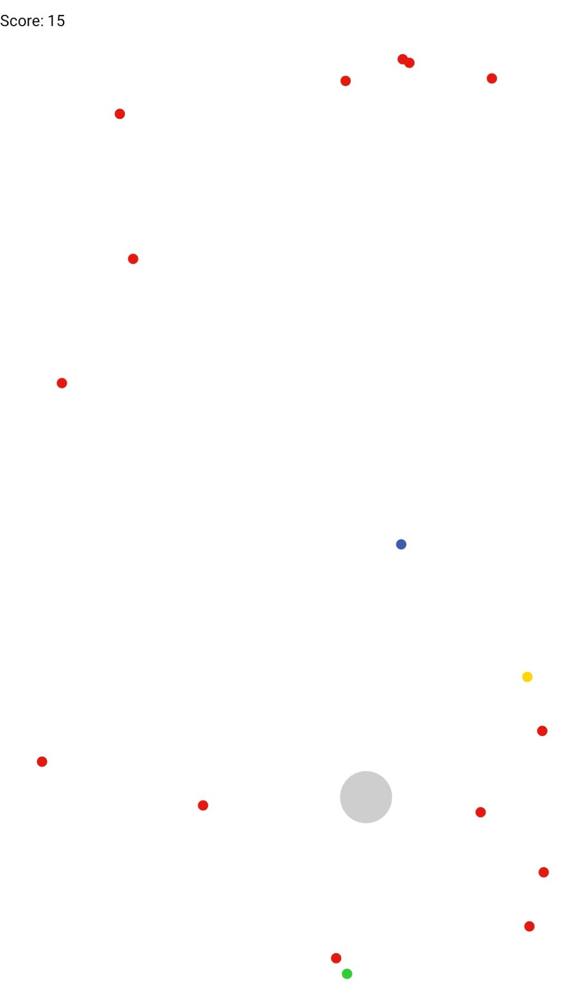

# A_ball_game
A simple Android game using gravity sensor.

 

## Rule
Swing the phone to control the gray ball to hit other balls.

If you hit the green ball, the gray ball becomes larger and score +1.

If you hit the blue ball, the gray ball returns to its original size and scores +2.

If you hit the yellow ball, the red ball in a certain range is eliminated, and the score is increased to the number of eliminated red ball +1.

If you hit the red ball, the game is over.
## Play
[**Download**](https://github.com/kbxpy12321/A_ball_game/raw/master/app-debug.apk)

